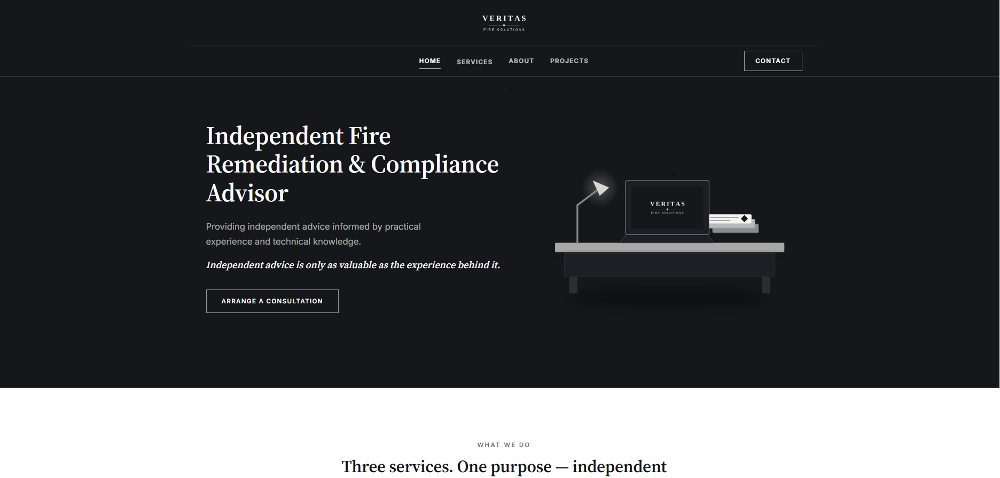

# Veritas Fire Solutions Website

A responsive commercial website developed for Veritas Fire Solutions, an independent fire remediation consultancy serving clients across London and the surrounding areas.

## Live Website

[Visit the Veritas Fire Solutions website](https://www.veritasfiresolutions.co.uk/)

## Project Overview

This website was designed and developed to establish a professional online presence for Veritas Fire Solutions. It presents the company’s services, experience and contact information in a clear and accessible format.

The design focuses on professional presentation, responsive behaviour and straightforward navigation across desktop, tablet and mobile devices.

## Technologies Used

- HTML5
- CSS3
- JavaScript
- Responsive web design
- Font Awesome icons
- Google Fonts

## Key Features

- Responsive navigation
- Mobile-friendly layout
- Services presentation
- About and experience sections
- Contact section
- Smooth scrolling and interactive elements
- Branded visual design
- Search-engine-friendly page structure

## My Contribution

I was responsible for:

- Planning the website structure
- Designing the interface and visual presentation
- Developing the website using HTML, CSS and JavaScript
- Creating the responsive desktop and mobile layouts
- Organising the company’s services and business content
- Preparing and deploying the completed website

## Client Permission

Published as portfolio work with the client’s written permission.

Veritas Fire Solutions retains ownership of its company name, branding, business information and original content. The source code is displayed to demonstrate the developer’s work and technical abilities.

## Developer

Developed by **Catalin Lazar**

- GitHub: [LaStarUs](https://github.com/LaStarUs)
